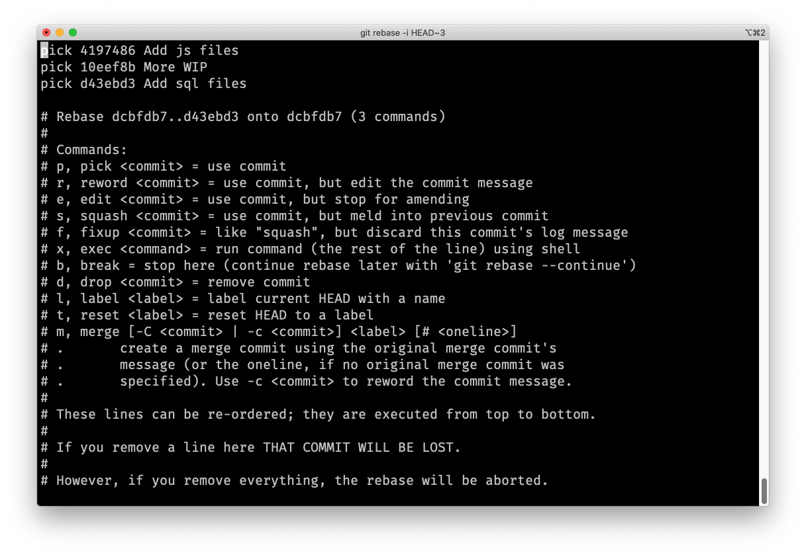

One good habit I have been trying to get into is committing my work in my feature branch as I go along, that serves a couple of purposes:

- I don't have to worry about losing my work with stashes. I use to rely on `stash` a lot & had run into quite a few instances where I almost lost my work in progress. 
- I can keep track of changes if something suddenly breaks. Basic idea is to make incremental changes.

Finally when I am ready to put up a pull request I can clean up those commits so that reviewer can easily review my pull request.

And sometimes you come across a commit where you realize you could have committed some files or changes as a separate, standalone meaningful commit. That's where interactive `rebase` comes in handy. 

I created a demo folder called `pull-request-demo` & initialized an empty git repository using `git init` to show how did I do it. Let's suppose I am working on a feature branch called `feature-1`:

- Let's create a new branch using `git checkout -b feature-1`

- Suppose the feature involves adding initial `js` files & we do that & we keep committing as we progress. 

- We feel we are now ready to put up a pull request so let's review our commits & funny enough, we come across a commit that can be split into two commits. Then let's start an interactive rebase using `git rebase -i HEAD~{number-of-commits}`.

- It will bring something like this, yours may be a bit different:

- In my case it was the commit with the hash `10eef8b`. Since it is `vim`, we have to use `vim`'s `insert` mode by pressing `i` & going to the line using the arrow keys.

- One of my favourite things about interactive `rebase` & `vim` is that how it has a handy section below the commits to show us what options we can use. For our purpose, we have to use `edit`. Change `pick` to `edit` & press `esc` key to get out of `insert` mode. 

- Now in order to order to proceed, we need to save this. We can use `:wq` for that.

- Rebase will now stop just after the commit you want to edit & then you would want to do `git reset HEAD~`.

- From then on, commit the pieces you want to be in individual commits & when you're done you can do `git rebase --continue` to finish the interactive `rebase`. If your changes are on remote as well, you may need to force push your changes via `git push -f`.

There you have it, changes separated in individual commits. It's up to you if you want to squash those commits further using the interactive `rebase` but now the difference would be that you would need to replace `pickup` with `squash` or `fixup` option to do that.
